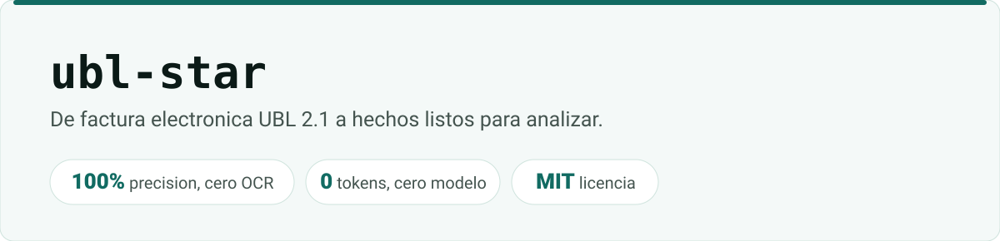

# ubl-star

<picture>
  <source media="(prefers-color-scheme: dark)" srcset="docs/assets/banner-dark.svg">
  
</picture>

**De factura electrónica UBL 2.1 a hechos listos para analizar.**

Donde la factura electrónica es obligatoria, el documento legal **no es el PDF: es el XML**. El PDF
es su representación gráfica — una foto del original. Leer el XML no es una optimización, es leer la
fuente: **100% de precisión, cero OCR, cero tokens, cero modelo.**

`ubl-star` toma ese XML y devuelve la **factura canónica** —emisor, receptor, líneas, impuestos y
totales— conforme a un [contrato de salida versionado](docs/contrato/factura-v1.md).

> ### Estado — léelo antes de instalar
>
> `ubl-star` es una **librería y una CLI**. Abre el ZIP del adjunto, localiza el XML, lo parsea al
> contrato y escribe el esquema estrella en Parquet o CSV con un solo comando. Lee facturas, notas
> crédito y notas débito.
>
> Todavía **no está publicado en PyPI**: hoy se instala desde el repositorio.
>
> Están probados los perfiles **DIAN** y **PEPPOL BIS 3.0 / EN 16931**, cada uno con factura y
> nota crédito (y nota débito en la DIAN), sobre fixtures sintéticas con su golden file.

## Por qué existe

Todo el esfuerzo de la industria está en leer el PDF: OCR, layout, modelos de visión, plantillas por
proveedor. Es trabajo real y difícil — pero en muchos países se está resolviendo un problema que ya
venía resuelto en el adjunto.

- **Colombia (DIAN)** — la factura se emite en XML UBL 2.1, firmada con certificado p12 y validada
  por los servicios web de la DIAN antes de llegar al receptor. El CUFE la identifica.
- **Europa (PEPPOL / EN 16931)** — el mismo UBL 2.1 como sintaxis de la factura electrónica
  transfronteriza.

Un solo parser cubre ambos: lo que cambia entre jurisdicciones son las extensiones y los campos
fiscales, no la estructura del documento. Es la tesis del proyecto, y las fixtures PEPPOL la
confirmaron con matices: PEPPOL pone algunos datos en otra ruta que el estándar también admite (el
vencimiento en `cbc:DueDate`, el IVA en `PartyTaxScheme`, el artículo en `cbc:Name`). El parser lee
cada una de esas rutas en un orden fijo, y cada una sale del estándar, no de una suposición.

## Cómo funciona

1. **Entrada** — un XML UBL 2.1, o el ZIP del adjunto que lo contiene. ✅
2. **Parseo** — sin adivinar: cada campo sale de su ruta en el estándar. ✅
3. **Mapeo** — al contrato de factura canónico (emisor, receptor, líneas, impuestos, totales). ✅
4. **Modelo** — esquema estrella → Parquet / CSV. ✅

No hay escalón caro porque no hay ambigüedad que resolver. Si un campo no está en el XML, no
está — y eso se reporta, no se inventa.

## Uso

```bash
pip install "git+https://github.com/CSalcedoDataBI/ubl-star@v0.2.6"
ubl-star model ./buzon-de-facturas --salida ./modelo
```

`@v0.2.6` fija la versión; sin él se instala lo último de `main`. Con [`uv`](https://docs.astral.sh/uv/)
no hace falta instalar nada: `uvx --from "git+https://github.com/CSalcedoDataBI/ubl-star@v0.2.6"
ubl-star model …`.

`ubl-star model` acepta archivos `.xml` o `.zip`, o carpetas, que recorre enteras. En `--salida`
escribe cinco tablas y un registro de lo que no pudo leer:

| Archivo | Qué es |
|---|---|
| `dim_proveedor` | un emisor por id fiscal |
| `dim_item` | un artículo por código y descripción |
| `dim_fecha` | calendario de años completos (sirve como tabla de fechas de Power BI) |
| `fact_factura` | un documento: totales, IVA, pagadero, vencimiento |
| `fact_factura_linea` | una línea: cantidad, precio, importe |
| `rechazados.csv` | cada archivo que no entró, con el motivo |

`--formato csv` escribe CSV en vez de Parquet. Las notas crédito llevan `signo = -1`, así que el
neto es `SUM(importe * signo)`. Si la misma factura llega dos veces (en el ZIP y suelta), cuenta
una sola vez y la copia queda en `rechazados.csv`. Por pantalla solo salen conteos, nunca datos de
las facturas.

Termina con código `0` si leyó todo, `1` si algún archivo quedó rechazado (las tablas se escriben
igual con lo demás) y `2` ante un error de uso.

Desde Python:

```python
from ubl_star.parser import leer

factura = leer("adjunto.zip")      # el contrato Invoice
factura.cuadra(), factura.problemas()
```

## Plugin de Claude Code

La carpeta [`plugin/`](plugin/) es un **plugin de Claude Code**, con una sola skill:
`leer-facturas-ubl`. Le dices a Claude «convierte estas facturas de la DIAN en tablas para Power BI»
o «¿cuánto IVA hay en esta carpeta?», y Claude llama a la CLI de `ubl-star` en vez de escribir un
parser propio.

```text
/plugin marketplace add CSalcedoDataBI/ubl-star
/plugin install ubl-star@ubl-star
```

Requisitos: [`uv`](https://docs.astral.sh/uv/) (o `pip`), `git` y Python ≥ 3.11.

### Qué ejecuta, qué envía y qué descarga (what it runs, sends and fetches)

- **Ejecuta** la CLI de `ubl-star` en tu máquina, **fijada a una versión exacta**:
  `uvx --from git+https://github.com/CSalcedoDataBI/ubl-star@vX.Y.Z ubl-star model ...`. Para
  responder preguntas sobre las tablas, ejecuta además un script corto de Python con la misma
  versión fijada.
- **Descarga**, solo la primera vez, el paquete de ese tag desde GitHub y sus dependencias desde
  PyPI (`pydantic`, `defusedxml`, `pyarrow`). Después queda en la caché de `uv`.
- **No envía nada a ningún servicio.** El parseo es local y no hace llamadas de red. Lo único que
  sale de tu máquina es lo que Claude lee de la salida, que entra en la conversación. Por eso la CLI
  solo imprime conteos, y la skill entrega archivos y agregados en vez de volcar filas con nombres,
  NIT o cédulas.

Política de privacidad del plugin: [PRIVACY.md](PRIVACY.md).

### Evals

`plugin/evals/` mide el plugin con y sin él sobre las fixtures sintéticas. La última corrida (3 por caso):

| Caso | Con plugin | Sin plugin |
|---|---|---|
| De un ZIP de la DIAN a tablas para Power BI | 1.00 | 0.00 |
| IVA neto, restando las notas crédito | 1.00 | 0.33 |
| Un PDF escaneado queda fuera de alcance | 1.00 | 1.00 |
| Claude no escribe un parser propio | 1.00 | 0.33 |

Cómo correrlos: [CONTRIBUTING.md](CONTRIBUTING.md#evals-del-plugin).

## Alcance — y lo que queda fuera a propósito

`ubl-star` lee **XML**. Si lo que tienes es un PDF escaneado, una foto o un PDF sin adjunto, esta no
es tu herramienta: la lectura óptica es otro problema, con otro costo, otra tasa de error y otra
forma de auditarse. **Mezclar los dos caminos es lo que hace que un extractor de facturas no se pueda
verificar** — cuando un campo puede venir de una ruta exacta del estándar o de un modelo que lo
adivinó, ya no sabes cuál de las dos ocurrió.

Aquí solo pasa lo primero. Un campo que no está en el XML se reporta ausente.

## El contrato de salida

Los campos, los tipos y las reglas de nulos que produce `ubl-star` están declarados en un **contrato
versionado**, y hay un test que ancla la salida a ese documento. La razón es que otra herramienta
—leyendo otra fuente— pueda entregar exactamente el mismo modelo y ser intercambiable aguas abajo,
sin compartir una línea de código con esta.

Son dos documentos, cada uno anclado por su test:

- [`factura-v1.md`](docs/contrato/factura-v1.md) declara la factura canónica, `invoice` e
  `invoice_line`.
- [`estrella-v1.md`](docs/contrato/estrella-v1.md) declara las cinco tablas que escribe
  `ubl-star model`, con sus columnas, tipos, claves y reglas.

## Contribuir

[CONTRIBUTING.md](CONTRIBUTING.md) tiene el entorno, los checks que corre el CI, cómo se añaden
fixtures y golden files, la regla de versiones y los evals. Una sola regla no se negocia: **ninguna
factura real** entra al repositorio, ni en un commit ni adjunta a un issue. Las fixtures son
sintéticas y un hook bloquea cualquier documento fuera de `tests/fixtures/`.

Los cambios de cada versión están en [CHANGELOG.md](CHANGELOG.md).

## Licencia

MIT. Solo dependencias con licencia permisiva (MIT / Apache-2.0 / BSD / PSF); nada AGPL ni GPL.

---

© Cristobal Salcedo · [CSalcedoDataBI](https://csalcedodatabi.com/)
